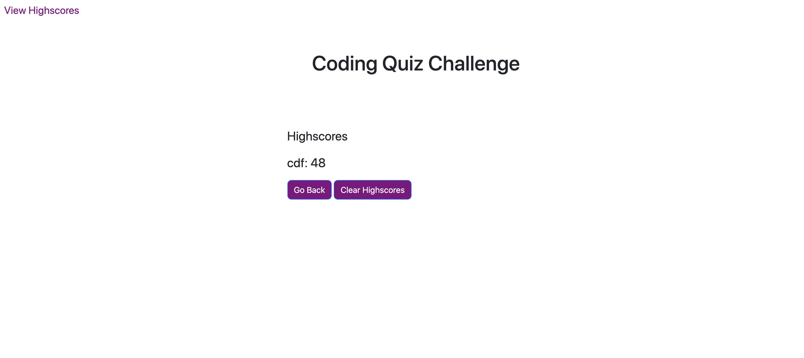

# Coding Quiz Challenge

This project is a timed Coding Quiz Challenge. You are scored by the amount of time left when finishing the quiz.

## How To Use

To play the challenge, you begin by clicking 'Start'. The time will begin as soon as the first question appears, so be sure to answer each question by clicking the correct answer. After answering each question, you will see either 'Correct!' or 'Wrong!'. At the end of the challenge, you will be shown your score and asked to enter your initials, then the top 5 scores will appear. You can then choose to 'Go Back' or 'Clear Highscores'.

### Resources

* 
* 

### Screenshot

### Links:

